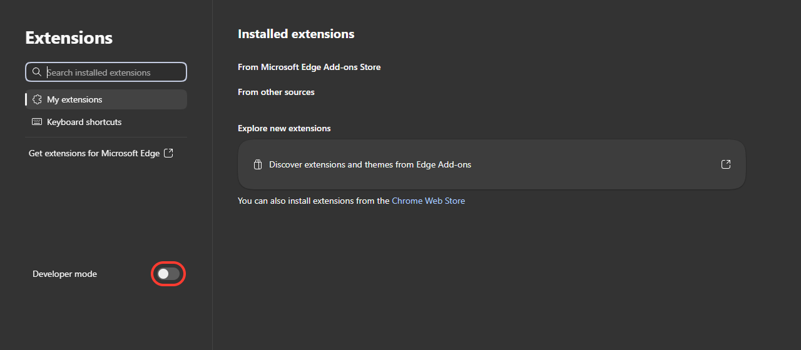
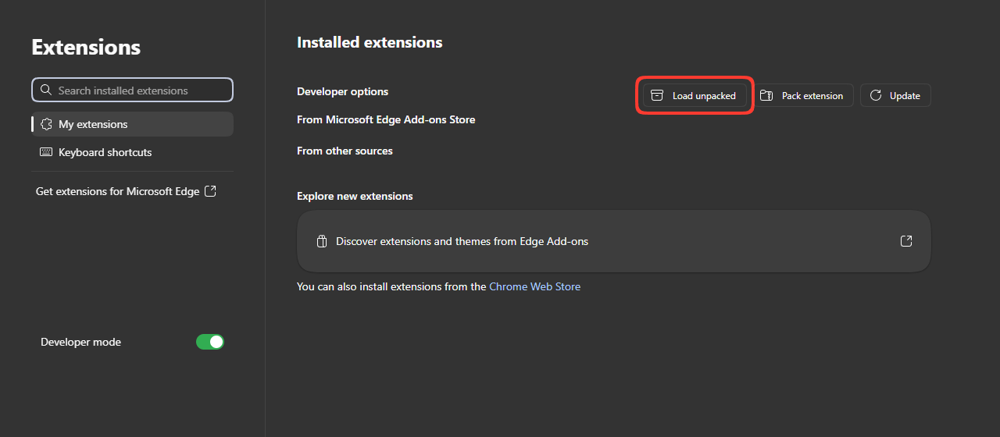
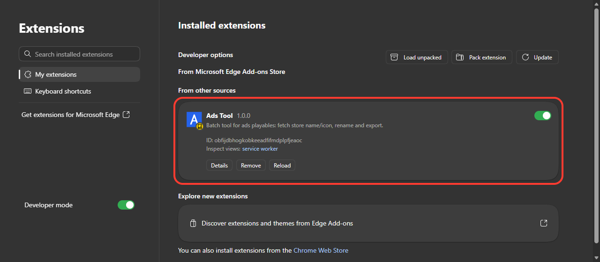
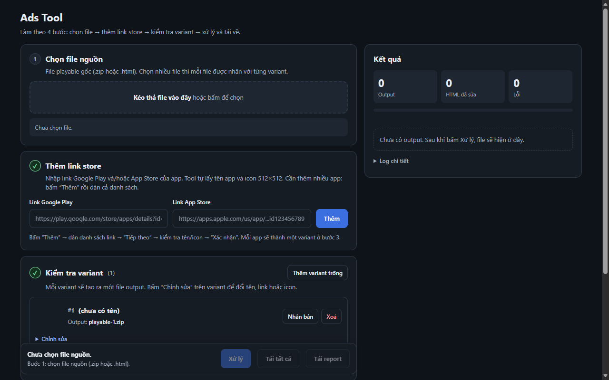

# Playable Batch

Công cụ làm hàng loạt cho playable ads: tự lấy tên app và icon từ Google Play / App Store, đổi tên file và xuất ra file ZIP.
Chạy trên Windows, Mac và Linux, trong Chrome, Edge hoặc Brave.

**Tải về: https://github.com/kat1002/ads-tool/releases/latest**

| File | Dùng cho |
|---|---|
| `playable-batch-extension.zip` | Windows, Mac, Linux (Chrome / Edge / Brave). Làm theo phần "Cài đặt" bên dưới. |
| `PlayableBatch.exe` | Chỉ Windows, bấm đúp là chạy (cần Microsoft Edge). Nếu Windows cảnh báo: bấm **More info** → **Run anyway**. |

## Cài đặt

1. Vào trang tải về ở trên, tải `playable-batch-extension.zip`, rồi **giải nén** ra một thư mục cố định (ví dụ `Documents\PlayableBatch`). **Không xoá hoặc di chuyển** thư mục này sau khi cài.
2. Mở trình duyệt, gõ `chrome://extensions` vào thanh địa chỉ (Edge: `edge://extensions`, Brave: `brave://extensions`), rồi bật **Developer mode** (Chế độ dành cho nhà phát triển).

   

3. Bấm **Load unpacked** (Tải tiện ích đã giải nén) và chọn thư mục vừa giải nén (thư mục có file `manifest.json`).

   

4. **Playable Batch** xuất hiện trong danh sách và đang bật là xong.

   

5. Bấm biểu tượng puzzle (Extensions) trên thanh công cụ, rồi bấm ghim (pin) cạnh **Playable Batch** để luôn thấy biểu tượng.

## Sử dụng

Bấm biểu tượng **Playable Batch** trên thanh công cụ, tool mở trong một tab mới.

**Ghi chú link** (nút **Link** nổi ở góc dưới bên phải):
- Lưu link ngay trên máy, chia theo danh mục.
- Dán link vào ô rồi nhấn Enter. Muốn ghi chú thì gõ sau link, cách một dấu cách.
- Bấm vào một dòng để copy link. Nút ⋯ trên dòng để mở link, sửa ghi chú, chuyển danh mục hoặc xoá.
- Nút ⋯ trên đầu widget để đổi tên hoặc xoá danh mục, xuất và nhập file `.txt` (để chuyển sang máy khác).
- Xoá nhầm thì bấm **Hoàn tác** trong vài giây.

**Thêm nhiều link cùng lúc:** trong widget bấm **Thêm nhiều**, dán nhiều dòng (mỗi dòng một link, ghi chú đặt sau link), chọn danh mục rồi bấm thêm. Link trùng được bỏ qua, và có nút **Hoàn tác**.

**Lấy link đã lưu:** ở bước 1 của hộp thoại thêm link, bấm **Từ ghi chú** để chọn các link Google Play / App Store đã lưu. Link nào đã có trong ô sẽ được đánh dấu "đã có" và không bị thêm lại.

## Cập nhật

Phiên bản hiện tại hiển thị ở đầu trang Playable Batch. Khi có bản mới, một banner **Cập nhật** sẽ hiện ra. Có hai cách:

- **Cách 1, bấm một nút (khuyên dùng):** cài "trình cập nhật" một lần, xem phần tiếp theo. Sau đó chỉ cần bấm **Cập nhật**.
- **Cách 2, làm tay:** tải `playable-batch-extension.zip` mới, giải nén đè lên thư mục cũ, mở `chrome://extensions`, bấm **Reload** ở Playable Batch. Xong thì xoá file zip đã tải.

Nếu chưa cài trình cập nhật, nút **Cập nhật** vẫn chạy được: bạn chọn thư mục đang cài Playable Batch (thư mục có `manifest.json`), tool tự tải và ghi đè file. Trình duyệt có thể hỏi lại quyền mỗi lần mở. Cách này không dùng được trên Brave (xem bên dưới).

## Cài trình cập nhật (làm một lần)

Giúp nút **Cập nhật** tự làm hết: tải bản mới, ghi đè file, tải lại extension và mở lại tool. Không cần quyền admin và không có gì chạy ngầm.

**Cần có:** Windows, Python 3, và Playable Batch đã cài như phần "Cài đặt" ở trên.

1. Cài **Python 3** từ https://www.python.org/downloads/ . Khi cài, nhớ tick **Add python.exe to PATH**.
2. Trong thư mục cài Playable Batch, bấm đúp **`install-updater.bat`**.
   - Nếu Windows cảnh báo (SmartScreen), bấm **More info** → **Run anyway**.
   - Nếu script hỏi ID extension, dán ID hiển thị trong hướng dẫn "Cài tự cập nhật" của tool.
3. Vào `chrome://extensions`, bấm **Reload** ở Playable Batch, rồi mở lại Playable Batch.

Từ giờ chỉ cần bấm **Cập nhật**. Muốn gỡ thì chạy `uninstall-updater.bat`.

Lưu ý:
- **Brave:** Brave tắt sẵn nút chọn thư mục, nên hãy dùng trình cập nhật. Hoặc bật `brave://flags/#file-system-access-api`, khởi động lại Brave rồi dùng cách chọn thư mục.
- **Đổi hoặc di chuyển thư mục cài:** chạy lại `install-updater.bat`.
- **Đã cài trình cập nhật từ bản cũ (tên Ads Tool):** sau khi cập nhật lên Playable Batch, chạy lại `install-updater.bat` một lần (tên trình cập nhật đã đổi). `uninstall-updater.bat` gỡ cả bản cũ lẫn bản mới.
- **Đang dùng bản 1.0.5 trở xuống:** cập nhật lên 1.0.6 một lần bằng cách làm tay, rồi chạy `install-updater.bat`.

Trình cập nhật hoạt động thế nào? (cho ai muốn biết)

1. Khi bấm **Cập nhật**, tool nhờ một script Python nhỏ (`updater/host.py`) tải bản mới từ GitHub. Script chỉ chạy lúc đó, không chạy ngầm.
2. Script kiểm tra file tải về (mã kiểm tra `.sha256` nếu có, và đúng tên, đúng phiên bản), rồi ghi đè file trong thư mục cài.
3. Tool tự tải lại và mở lại.

Không có file zip nào được lưu lại: bản tải về nằm trong bộ nhớ, file tạm được xoá sau khi xong (kể cả khi lỗi). Chỉ file zip bạn tự tải tay mới cần tự xoá. Script chỉ nhận lệnh từ đúng extension này và chỉ ghi vào thư mục Playable Batch.

## Lỗi thường gặp

- **Không thấy nút Load unpacked:** chưa bật Developer mode (bước 2 của phần Cài đặt).
- **Chọn thư mục báo lỗi manifest:** chọn nhầm thư mục. Phải chọn thư mục chứa trực tiếp file `manifest.json`, không phải file zip và không phải thư mục cha.
- **Extension biến mất sau khi khởi động lại trình duyệt:** thư mục đã bị xoá hoặc di chuyển. Đặt lại thư mục ở chỗ cố định rồi Load unpacked lại.
- **Trình duyệt từ chối thư mục đã chọn:** thư mục nằm trong chỗ hệ thống như `AppData`. Chuyển Playable Batch sang `Documents\PlayableBatch` rồi Load unpacked lại.
- **"Access to the specified native messaging host is forbidden":** extension đang chạy từ thư mục khác với thư mục đã cài trình cập nhật. Chạy lại `install-updater.bat` trong đúng thư mục đang Load unpacked, rồi Reload extension.
- **`install-updater.bat` báo thiếu Python:** cài Python 3 (tick **Add python.exe to PATH**) rồi chạy lại. Nếu SmartScreen chặn, bấm **More info** → **Run anyway**.
- **Máy công ty chặn cài extension:** liên hệ IT, hoặc dùng `PlayableBatch.exe` (Windows).

## Bản HTML (không cần extension)

Branch `html-only` có `playable-batch-standalone.html`: một file duy nhất, mở bằng trình duyệt là dùng được, không cần cài extension. Ghi chú link lưu trong `localStorage` của trình duyệt. Không có kiểm tra/cập nhật phiên bản.

- Tên/icon nhập tay; không có kết nối mạng. Ghi tên sau link trên cùng dòng (hoặc sửa trong bảng kiểm tra) và bấm “Chọn ảnh” để chọn icon.
- Tạo lại file: `python build-standalone.py` (đọc `playable-batch.html`, `playable-batch.js`, `jszip.min.js`, không sửa các file này).

## Bản Chrome Web Store

Bản gửi lên Chrome Web Store không có hệ thống tự cập nhật (không `alarms`, `nativeMessaging`, không gọi GitHub). Bản GitHub trên `main` vẫn giữ tự cập nhật.

- Tạo gói: `python build-store.py` (đọc `manifest.json`, `playable-batch.html`, `playable-batch.js`, `jszip.min.js`, `icons/`, không sửa các file này).
- Kết quả: thư mục `store-build/` và `playable-batch-store.zip` (manifest.json ở gốc zip, version lấy từ `manifest.json`).
- Hồ sơ đăng: xem `store-listing.md`.

## Development

- Edit the files here, then click reload on `chrome://extensions`.
- `playable-batch.js` is the app; `playable-batch.html` is markup + CSS; `jszip.min.js` is JSZip 3.10.1.
- Store fetch (`fetchPlay`, `fetchAppStore`) runs straight from the extension page. `host_permissions` in `manifest.json` lift CORS for the store and image hosts.
- Release: bump `version` in `manifest.json`, then `git tag vX.Y.Z && git push --tags`. The workflow attaches `playable-batch-extension.zip` to a GitHub Release, and its `windows-exe` job builds `PlayableBatch.exe` from the `exe` branch and uploads it to the same release.
- The `exe` branch page (`playable-batch.html` there) is generated from main's files: on `exe`, run `python build-exe-page.py` (it reads `git show main:...`), and set `VERSION` in `store-helper.py` to the new version. Do this and commit on `exe` (and push it) before tagging, otherwise the `windows-exe` job fails on the version check or ships a stale page.
